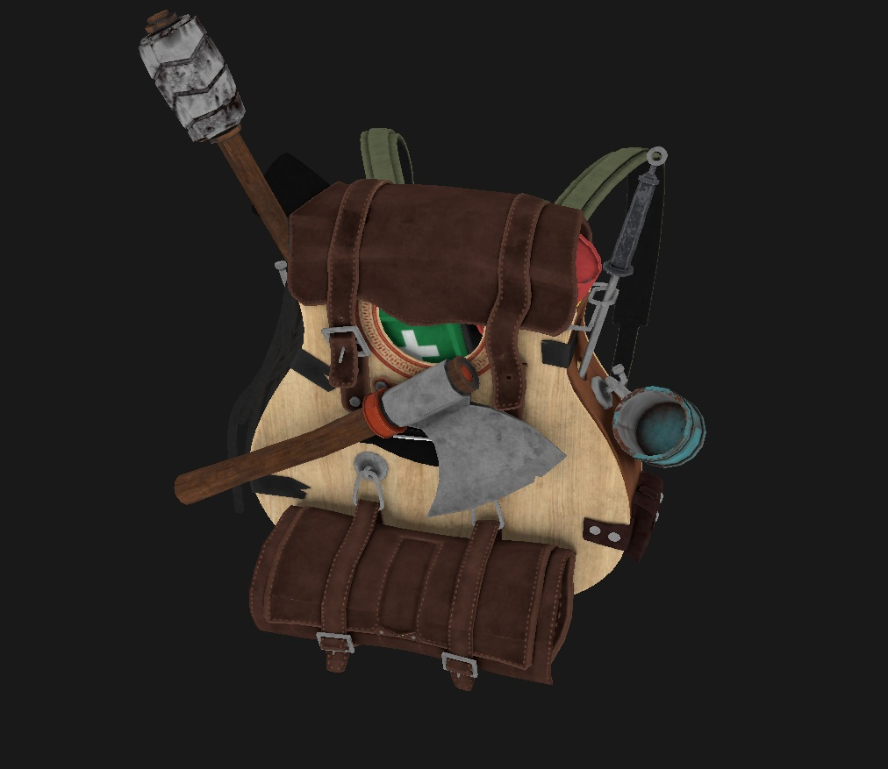

# OpenGoodLuck

Just a project to learn about OpenGL.

Currently displays a window with backpack (no lighting, plain colors). 



This figure is drawn in perspective using all the chapters of [OpenGL tutorial](https://learnopengl.com/Getting-started/Review) up to 'Model', with shaders written in separate files and code refactored to an OOP style. Figure is being read from object file. It also spins with funny music in the background

## Installation

1. Clone the repository:

```git clone https://github.com/CP-IATE/OpenGoodLuck```

2. Install [SDL3](https://github.com/libsdl-org/SDL/blob/main/INSTALL.md), in your project using guide. Download [GLM root dir](https://github.com/g-truc/glm/tree/master/glm) and link it to the project. Download and compile [assimp](https://github.com/assimp/assimp/blob/master/Build.md) as dll an place it in project root 

## Build and Run

Build and run using Visual Studio

## Contributing

Pull requests are welcome. For major changes, please open an issue first
to discuss what you would like to change.

## License

This project is for learning purposes.